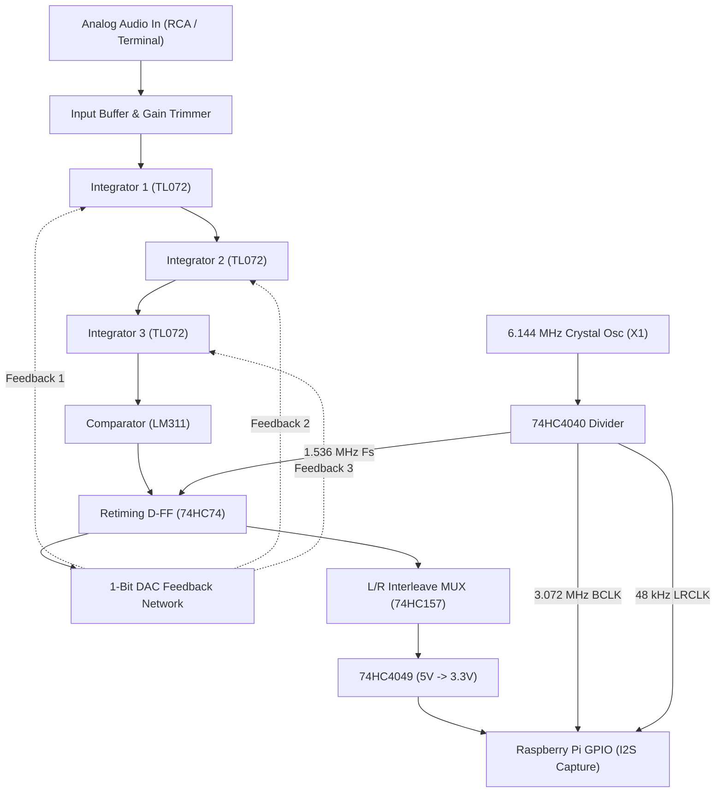

# Vinyl ADC

> **Discrete 3rd-Order Continuous-Time Delta-Sigma Stereo Audio ADC**  
> Built from jelly-bean analog & CMOS components — **no ADC IC anywhere in the signal path**.

<p align="center">
  
</p>

A purpose-built stereo audio analog-to-digital converter designed to digitize vinyl turntable audio. It connects between a turntable phono preamplifier and a Raspberry Pi capturing a raw 3.072 Mbps bit-interleaved PDM stream for software decimation (CIC + FIR) into high-fidelity 24-bit / 48 kHz FLAC.

```
Pro-Ject Debut Carbon ──> Phono Preamp ──> [ VINYL ADC ] ──> Raspberry Pi ──> FLAC ──> Jellyfin
                                            Analog -> PDM     CIC + FIR DSP
```

---

## The 4-Board PCB Stack

The converter is partitioned into four 100 × 100 mm stacked circuit boards, fabricated on an isolation milling machine (e.g. Roland SRM-20) and connected via 2×8 2.54 mm stacking headers and M3 brass standoffs:

| Tier & Board | 3D Raytraced Board Render | Function & Key Components |
|---|:---:|---|
| **Tier 4 (Top)**<br>[`vinyl_adc_digital`](hardware/kicad/digital/) |  | **Clock, Interleaving & Pi Interface:**<br>• 6.144 MHz crystal oscillator can (`X1`)<br>• `74HCT132` Schmitt-trigger clock buffer<br>• `74HC4040` binary clock divider (1.536 MHz $F_s$, 3.072 MHz BCLK, 48 kHz LRCLK)<br>• `74HC157` stereo bit-interleaving MUX<br>• `74HC4049` 5 V $\rightarrow$ 3.3 V level shifter to Raspberry Pi |
| **Tier 3**<br>[`vinyl_adc_channel_l`](hardware/kicad/channel_l/) |  | **Left Channel Modulator:**<br>• 3rd-order active RC integrators (`TL072`)<br>• `LM311` high-speed comparator<br>• `74HC74` retiming flip-flop & 1-bit DAC network<br>• Multi-turn input gain trim potentiometer<br>• Jumper set to Left (`pins 1-2`) |
| **Tier 2**<br>[`vinyl_adc_channel_r`](hardware/kicad/channel_r/) |  | **Right Channel Modulator:**<br>• Identical artwork to Tier 3 (milled twice)<br>• Jumper set to Right (`pins 2-3`)<br>• Independent ground plane & analog reference |
| **Tier 1 (Base)**<br>[`vinyl_adc_power`](hardware/kicad/power/) |  | **Power & Reference Generation:**<br>• `74HC244` + `1N5817` charge-pump negative rail<br>• Low-noise precision virtual ground reference (`TL072`)<br>• High-capacity bulk reservoir & post-filter network<br>• 4× M3 mounting holes seated onto enclosure floor bosses |

---

## System Architecture & Signal Flow



- **Expected Performance: 68–70 dB SNR**, purposefully matched to vinyl's physical dynamic range.
- **Bit-Interleaved Stream:** Both channels alternate bits on a single line at 3.072 Mbps. The Pi captures this as standard 48 kHz / 32-bit stereo I2S.
- **Software Decimation:** A dedicated CIC (Cascaded Integrator-Comb) filter + compensation FIR filter runs on the Raspberry Pi CPU to produce clean 24-bit / 48 kHz audio.

---

## Enclosure & Manufacturing

The project includes complete manufacturing files for both 3D printing and laser cutting:

### Files in [`enclosure/`](enclosure/):

| File | Type | Description |
|---|---|---|
| [**`vinyl_adc_enclosure_base.3mf`**](enclosure/vinyl_adc_enclosure_base.3mf) | PrusaSlicer 3MF | **Recommended for 3D printing.** Explicit millimeter headers, zero overhang, sits flat on bed ($144 \times 144 \times 65\text{ mm}$). |
| [**`vinyl_adc_enclosure_base.stl`**](enclosure/vinyl_adc_enclosure_base.stl) | Binary STL | 100% watertight 2-manifold (`manifold = yes`, `open_edges = 0`), positive build quadrant ($X, Y, Z \ge 0$). |
| [**`vinyl_adc_plexiglass_top.svg`**](enclosure/vinyl_adc_plexiglass_top.svg) | Laser SVG | 1:1 scale for Adobe Illustrator (72 pt/in calibrated, $140 \times 140\text{ mm}$, $0.01\text{ mm}$ pure Red cut strokes). |
| [**`vinyl_adc_plexiglass_top.dxf`**](enclosure/vinyl_adc_plexiglass_top.dxf) | AutoCAD R12 DXF | 1:1 DXF for laser cutting / CNC milling (`1 Units = 1 Millimeter`). |
| [**`vinyl_adc_enclosure.blend`**](enclosure/vinyl_adc_enclosure.blend) | Blender CAD | Full animated parametric scene with real KiCad 3D PCB exports, connectors, fasteners, and timeline animation. |

### Fastening Architecture:
- **Lid Screws & Heated Inserts:** 4× M3 heated inserts seated into solid corner pillars at $(\pm 64.0\text{ mm}, \pm 64.0\text{ mm})$ with $4.57\text{ mm}$ of internal plastic casing. 4× M3 $\times$ 8 mm stainless screws clamp the $3.0\text{ mm}$ clear acrylic top lid.
- **PCB Stack Retention:** 4× floor mounting bosses ($\varnothing 9.0\text{ mm}$, height $6.0\text{ mm}$) at $(\pm 44.0\text{ mm}, \pm 44.0\text{ mm})$ with M3 heat-set inserts. Four M3 $\times$ 6 mm base standoffs thread into the base, followed by 12× M3 $\times$ 11 mm standoffs and 4× top M3 brass nuts clamping the entire stack.
- **Underside Screws:** Counterbored through-holes allow M3 screws to be driven from underneath directly into the base standoffs.

---

## Laser Cutting the Acrylic Top Lid (GCC Spirit)

1. Open [**`vinyl_adc_plexiglass_top.dxf`**](enclosure/vinyl_adc_plexiglass_top.dxf) or [**`vinyl_adc_plexiglass_top.svg`**](enclosure/vinyl_adc_plexiglass_top.svg) in Adobe Illustrator.
   - For DXF: Ensure **Scale:** `1 Units = 1 Millimeters` (100%).
   - For SVG: Verify width is $140.0\text{ mm}$ and height is $140.0\text{ mm}$.
2. Copy the drawing into the lab's `lasercutter template`.
3. Check stroke rules:
   - **Cut Lines:** Color Red (`#FF0000`), stroke width **`0.01 mm`** (`0.028 pt`).
   - **Engrave (Optional):** Color Black (`#000000`), raster fill.
4. Print via GCC Spirit Driver: Select `Acrylic 3.0 mm` from history, autofocus origin $(0, 0)$, and run!

---

## Repository Structure

```
├── enclosure/                      # 3D print and laser cutting files
│   ├── vinyl_adc_enclosure.blend  # Complete Blender 3D CAD scene
│   ├── vinyl_adc_enclosure_base.3mf # PrusaSlicer print file
│   ├── vinyl_adc_enclosure_base.stl # Watertight binary STL
│   ├── vinyl_adc_plexiglass_top.svg # 1:1 Spirit laser cutter SVG
│   ├── vinyl_adc_plexiglass_top.dxf # 1:1 AutoCAD R12 DXF
│   └── *.glb                      # 3D board exports from KiCad
├── hardware/kicad/                 # KiCad 10 schematics, boards & routing
│   ├── power/                     # Tier 1: Power & voltage reference board
│   ├── channel_l/                 # Tier 2 & 3: Modulator channel (milled twice)
│   ├── digital/                   # Tier 4: Digital clock & Pi interface
│   ├── sim/                       # 8x SPICE testbenches for loop validation
│   └── tools/                     # Python layout and netlist verification scripts
├── production/                     # Production-ready Gerbers and milling DXFs
├── docs/                           # Documentation
│   ├── shopping-list.md           # Component shop procurement list
│   ├── bom.md                     # Bill of materials
│   └── design-notes.md            # Circuit design decisions and SPICE findings
├── media/                          # Visuals, renders, and animations
│   ├── vinyl_adc_assembly.gif     # Looping 3D exploded view animation
│   ├── vinyl_adc_assembly.mp4     # 720p 24fps H.264 animation video
│   └── pcb_renders/               # Raytraced KiCad 3D renders of each PCB tier
└── sim/                            # Modulator numerical simulation models
```

---

## License

MIT License — free for personal and educational use.
