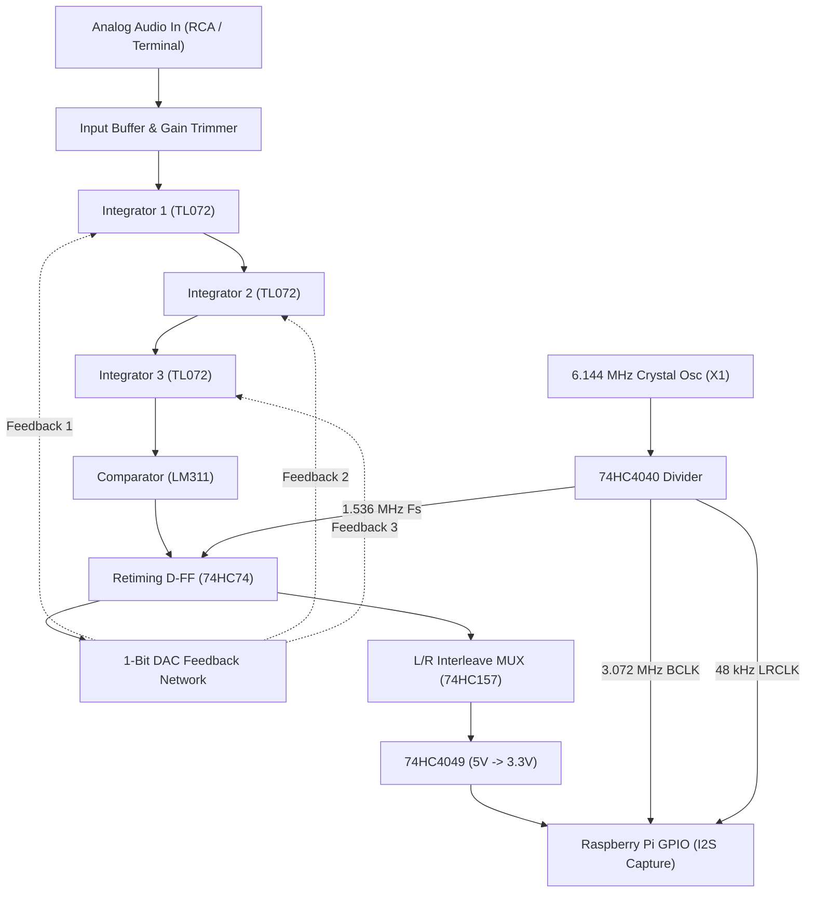

# Vinyl ADC

> **Discrete 3rd-Order Continuous-Time Delta-Sigma Stereo Audio ADC**  
> Built from jelly-bean analog & CMOS components — **no ADC IC anywhere in the signal path**.

<p align="center">
  
</p>

A purpose-built stereo audio analog-to-digital converter designed to digitize vinyl turntable audio. It connects between a turntable phono preamplifier and a Raspberry Pi capturing a raw 3.072 Mbps bit-interleaved PDM stream for software decimation (CIC + FIR) into high-fidelity 24-bit / 48 kHz FLAC.

```
Pro-Ject Debut Carbon ──> Phono Preamp ──> [ VINYL ADC ] ──> Raspberry Pi ──> FLAC ──> Jellyfin
                                            Analog -> PDM     CIC + FIR DSP
```

---

## Key Highlights

- **No ADC Chip:** Discrete third-order loop constructed from op-amp integrators, an LM311 high-speed comparator, a 74HC74 retiming flip-flop, and precision resistor-switched DAC feedback.
- **Matched Dynamic Range:** Optimized for **68–70 dB SNR**, matching the physical noise floor of vinyl playback without unnecessary over-engineering.
- **Interleaved I2S Stream:** Both channels are interleaved onto a single data line, appearing to the Raspberry Pi as a standard 48 kHz / 32-bit stereo I2S capture.
- **4-Board Stacked Architecture:** Modular PCB stack connected via 2×8 2.54 mm stacking headers and M3 brass standoffs:
  - **Tier 1 (Base):** Power Supply & Reference Board (`vinyl_adc_power`)
  - **Tier 2:** Right Channel Modulator (`vinyl_adc_channel_r`)
  - **Tier 3:** Left Channel Modulator (`vinyl_adc_channel_l`)
  - **Tier 4 (Top):** Digital Clock, Interleaving Logic & Pi Interface (`vinyl_adc_digital`)
- **Custom 3D-Printed & Laser-Cut Enclosure:** Sleek PETG chassis with recessed clear acrylic lid, M3 heat-set inserts, gold RCA jacks, ground post, and trim potentiometer.

---

## System Architecture



---

## Enclosure & Physical Manufacturing

The project includes complete manufacturing files for both 3D printing and laser cutting:

<p align="center">
  
</p>

### Files in [`enclosure/`](enclosure/):

| File | Type | Description |
|---|---|---|
| [**`vinyl_adc_enclosure_base.3mf`**](enclosure/vinyl_adc_enclosure_base.3mf) | PrusaSlicer 3MF | **Recommended for 3D printing.** Explicit millimeter headers, zero overhang, sits flat on bed ($144 \times 144 \times 65\text{ mm}$). |
| [**`vinyl_adc_enclosure_base.stl`**](enclosure/vinyl_adc_enclosure_base.stl) | Binary STL | 100% watertight 2-manifold (`manifold = yes`, `open_edges = 0`), positive build quadrant ($X, Y, Z \ge 0$). |
| [**`vinyl_adc_plexiglass_top.svg`**](enclosure/vinyl_adc_plexiglass_top.svg) | Laser SVG | 1:1 scale for Adobe Illustrator (72 pt/in calibrated, $140 \times 140\text{ mm}$, $0.01\text{ mm}$ pure Red cut strokes). |
| [**`vinyl_adc_plexiglass_top.dxf`**](enclosure/vinyl_adc_plexiglass_top.dxf) | AutoCAD R12 DXF | 1:1 DXF for laser cutting / CNC milling (`1 Units = 1 Millimeter`). |
| [**`vinyl_adc_enclosure.blend`**](enclosure/vinyl_adc_enclosure.blend) | Blender CAD | Full animated parametric scene with real KiCad 3D PCB exports, connectors, fasteners, and timeline animation. |

### Fastening Architecture:
- **Enclosure Lid:** 4× M3 heated inserts seated into solid corner pillars at $(\pm 64.0\text{ mm}, \pm 64.0\text{ mm})$, providing $4.57\text{ mm}$ of internal plastic wall casing. 4× M3 $\times$ 8 mm stainless hex button-head screws clamp the $3.0\text{ mm}$ clear acrylic lid.
- **PCB Stack Mounting:** 4× floor bosses ($\varnothing 9.0\text{ mm}$, height $6.0\text{ mm}$) at $(\pm 44.0\text{ mm}, \pm 44.0\text{ mm})$ with M3 heat-set inserts. Four M3 $\times$ 6 mm male-female base standoffs thread into the floor, followed by 12× M3 $\times$ 11 mm hex standoffs and 4× top M3 brass nuts clamping the entire stack.
- **Underside Retention:** Counterbored through-holes allow M3 screws to be driven from underneath directly into the base standoffs.

---

## Repository Structure

```
├── enclosure/                      # 3D print and laser cutting files
│   ├── vinyl_adc_enclosure.blend  # Complete Blender 3D CAD scene
│   ├── vinyl_adc_enclosure_base.3mf # PrusaSlicer print file
│   ├── vinyl_adc_enclosure_base.stl # Watertight binary STL
│   ├── vinyl_adc_plexiglass_top.svg # 1:1 Spirit laser cutter SVG
│   ├── vinyl_adc_plexiglass_top.dxf # 1:1 AutoCAD R12 DXF
│   └── *.glb                      # 3D board exports from KiCad
├── hardware/kicad/                 # KiCad 10 schematics, boards & routing
│   ├── power/                     # Tier 1: Power & voltage reference board
│   ├── channel_l/                 # Tier 2 & 3: Modulator channel (milled twice)
│   ├── digital/                   # Tier 4: Digital clock & Pi interface
│   ├── sim/                       # 8x SPICE testbenches for loop validation
│   └── tools/                     # Python layout and netlist verification scripts
├── production/                     # Production-ready Gerbers and milling DXFs
├── docs/                           # Documentation
│   ├── shopping-list.md           # Component shop procurement list
│   ├── bom.md                     # Bill of materials
│   └── design-notes.md            # Circuit design decisions and SPICE findings
├── media/                          # Assembly renders, videos, and animations
│   ├── vinyl_adc_assembly.mp4     # 720p 24fps H.264 animation video
│   └── vinyl_adc_assembly.gif     # Looping README animation
└── sim/                            # Modulator numerical simulation models
```

---

## Laser Cutting the Acrylic Top Lid (GCC Spirit)

1. Open [**`vinyl_adc_plexiglass_top.dxf`**](enclosure/vinyl_adc_plexiglass_top.dxf) or [**`vinyl_adc_plexiglass_top.svg`**](enclosure/vinyl_adc_plexiglass_top.svg) in Adobe Illustrator.
   - For DXF: Ensure **Scale:** `1 Units = 1 Millimeters` (100%).
   - For SVG: Verify width is $140.0\text{ mm}$ and height is $140.0\text{ mm}$.
2. Copy the drawing into the lab's `lasercutter template`.
3. Check stroke rules:
   - **Cut Lines:** Color Red (`#FF0000`), stroke width **`0.01 mm`** (`0.028 pt`).
   - **Engrave (Optional):** Color Black (`#000000`), raster fill.
4. Print via GCC Spirit Driver: Select `Acrylic 3.0 mm` from history, autofocus origin $(0, 0)$, and run!

---

## License

MIT License — free for personal and educational use.
