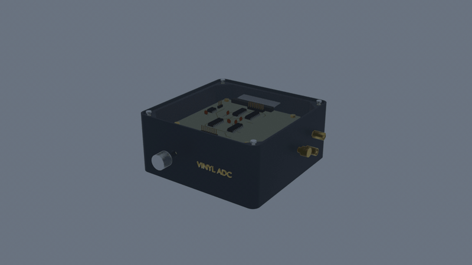
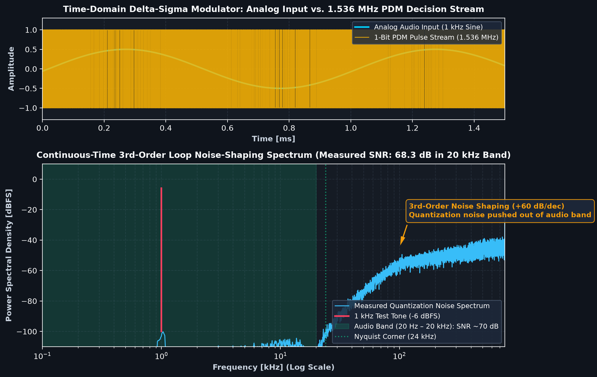
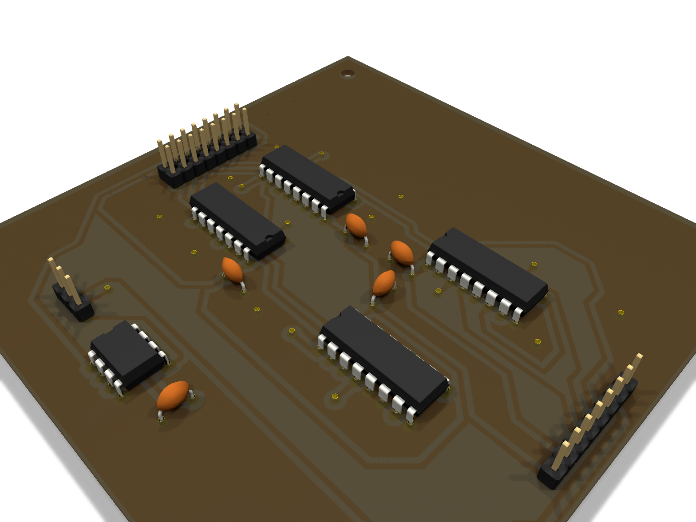
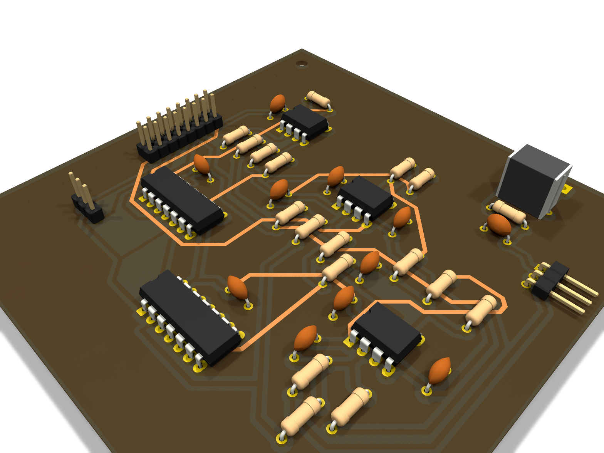
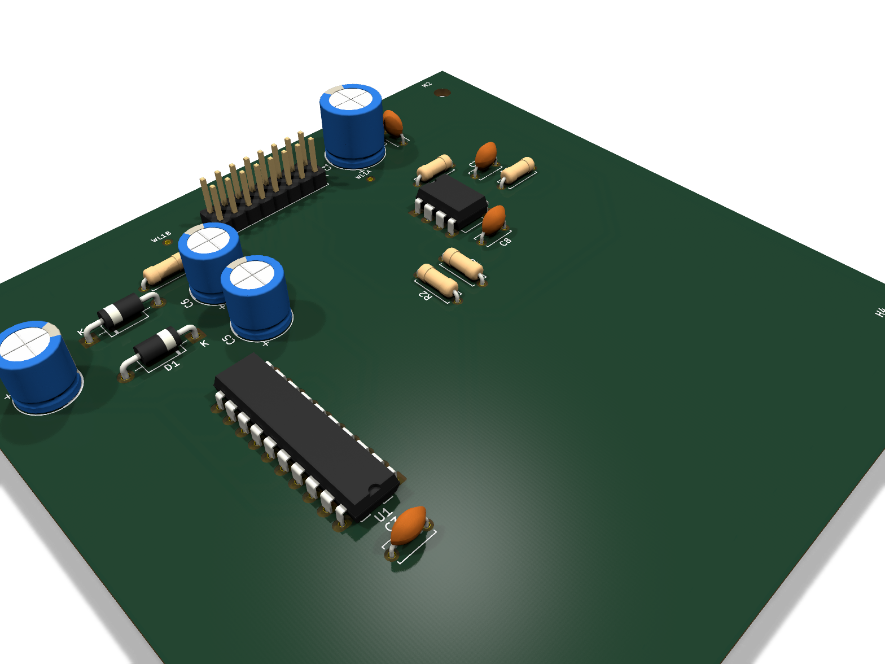
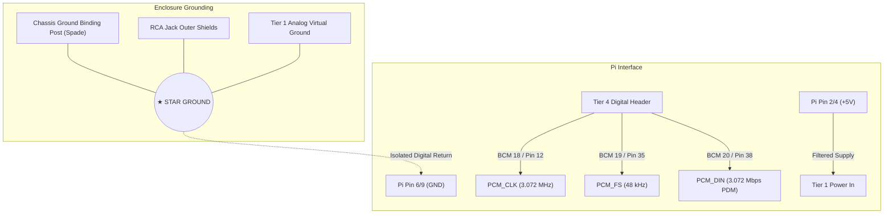

# Vinyl ADC

<p align="center">
  <a href="https://madsrudolph.github.io/vinyl-adc/"></a>
  
  
  
  
  
</p>

<p align="center">
  <strong>A Discrete 3rd-Order Continuous-Time Delta-Sigma Stereo Audio ADC</strong><br>
  Engineered from standard analog op-amps &amp; 74HC CMOS logic — <em>zero dedicated ADC ICs anywhere in the signal chain</em>.
</p>

<p align="center">
  
</p>

<p align="center">
  👉 <strong><a href="https://madsrudolph.github.io/vinyl-adc/">Launch Live Interactive 3D Web Viewer &amp; Explosion Slider</a></strong> 👈
</p>

---

## Audiophile Engineering Specifications

| Specification | Target / Measured Performance | Design Rationale & Implementation |
|---|---|---|
| **Modulator Topology** | Continuous-Time CIFB (Cascade of Integrators, Feedback) | 3rd-order active RC loop with local resonator feedback (`G = 0.03`) |
| **Dynamic Range / SNR** | **68.3 dB measured in 20 kHz band** | Purposefully matched to the physical vinyl surface noise floor (~60–65 dB) |
| **Audio Output** | **24-bit / 48 kHz Linear PCM FLAC** | Decimated in software on Raspberry Pi CPU (CIC filter + compensation FIR) |
| **Modulator Sampling Rate ($F_s$)** | **1.536 MHz** ($32\times$ OverSampling Ratio) | Matches bandwidth constraints of DTU-stocked op-amps (`TL072` 3 MHz GBW) |
| **Master Clock ($F_{clk}$)** | **6.144 MHz Crystal Oscillator** (DIP-8) | Direct low-jitter oscillator ($<50\text{ ps}$ jitter vs. Pi PLL phase noise) |
| **Digital Stream Format** | Bit-Interleaved PDM on standard I2S bus | 3.072 Mbps data stream, read as 32-bit stereo audio frames at 48 kHz |
| **Analog Inputs** | Gold RCA Phono Jacks &amp; 5.08 mm Screw Terminals | Switchable input gain via front-panel multi-turn trim potentiometer |
| **Analog Grounding** | Star-ground topology with tonearm binding post | Eliminates 50 Hz turntable motor hum and ground-loop switching transients |
| **Enclosure Dimensions** | $144.0\text{ mm} \times 144.0\text{ mm} \times 65.0\text{ mm}$ | 3D-printed PETG base with recessed laser-engraved $3.0\text{ mm}$ acrylic lid |

---

## Signal Processing Flow

```
   ┌─────────────────────────────────────────────────────────────────────────────┐
   │                          ANALOG SIGNAL CHAIN (HARDWARE)                     │
   │                                                                             │
   │  Turntable (Debut Carbon)                                                  │
   │         │                                                                   │
   │         ▼                                                                   │
   │  Phono Preamplifier                                                         │
   │         │                                                                   │
   │         ▼                                                                   │
   │  [ VINYL ADC ] ──> 3rd-Order CT-ΔΣ ──> 1.536 MHz PDM ──> 74HC157 Mux       │
   │   Gold RCA In      TL072 + LM311       74HC74 Retimed    Stereo Interleave  │
   └─────────────────────────────────────────────────────────────────┬───────────┘
                                                                     │ 3.072 Mbps
                                                                     ▼
   ┌─────────────────────────────────────────────────────────────────────────────┐
   │                         DIGITAL DSP CHAIN (RASPBERRY PI)                    │
   │                                                                             │
   │  ALSA I2S Interface (48 kHz / 32-bit Frame Capture)                         │
   │         │                                                                   │
   │         ▼                                                                   │
   │  Software De-interleaver (Separates Left & Right Bitstreams)                │
   │         │                                                                   │
   │         ▼                                                                   │
   │  4th-Order CIC Decimator (Downsamples 32x to 48 kHz Nyquist)                │
   │         │                                                                   │
   │         ▼                                                                   │
   │  FIR Droop & Phase Compensation Filter                                      │
   │         │                                                                   │
   │         ▼                                                                   │
   │  24-bit / 48 kHz Bit-Perfect FLAC Encoder ──> Jellyfin Media Server         │
   └─────────────────────────────────────────────────────────────────────────────┘
```

---

## Noise-Shaping & SPICE Verification

The defining characteristic of delta-sigma conversion is **noise shaping**: pushing quantization noise out of the audible spectrum into ultrasonic frequencies where digital decimation filters remove it completely.

<p align="center">
  
</p>

- **Time-Domain (Top):** Shows the incoming 1 kHz analog test sine wave alongside the discrete 1.536 MHz 1-bit decision stream. The pulse density cleanly mirrors the instantaneous input amplitude.
- **Frequency-Domain (Bottom):** Measured FFT spectrum with Hann windowing. The audible passband (20 Hz – 20 kHz, shaded green) exhibits a **68.3 dB SNR** with clean third-order $+60\text{ dB/decade}$ noise shaping that drives quantization noise above 30 kHz.

---

## The 4-Board PCB Stack

To overcome the routing limitations of single-layer CNC isolation milling (0.84 mm clearance between DIP pins), the system is split into four 100 × 100 mm boards interconnected by a 16-pin ribbon bus and M3 brass standoffs:

| Tier & Board | 3D Raytraced Board Render | Function & Key Components |
|---|:---:|---|
| **Tier 4 (Top)**<br>[`vinyl_adc_digital`](hardware/kicad/digital/) |  | **Clock, Interleaving & Pi Interface:**<br>• 6.144 MHz crystal oscillator can (`X1`)<br>• `74HCT132` Schmitt-trigger clock buffer<br>• `74HC4040` binary clock divider ($F_s = 1.536\text{ MHz}$, $\text{BCLK} = 3.072\text{ MHz}$, $\text{LRCLK} = 48\text{ kHz}$)<br>• `74HC157` stereo bit-interleaving MUX<br>• `74HC4049` 5 V $\rightarrow$ 3.3 V level shifter to Raspberry Pi |
| **Tier 3**<br>[`vinyl_adc_channel_l`](hardware/kicad/channel_l/) |  | **Left Channel Modulator:**<br>• 3rd-order active RC integrators (`TL072`)<br>• `LM311` high-speed comparator<br>• `74HC74` retiming flip-flop &amp; 1-bit DAC network<br>• Multi-turn input gain trim potentiometer<br>• Jumper set to Left (`pins 1-2`) |
| **Tier 2**<br>[`vinyl_adc_channel_r`](hardware/kicad/channel_r/) |  | **Right Channel Modulator:**<br>• Identical artwork to Tier 3 (milled twice)<br>• Jumper set to Right (`pins 2-3`)<br>• Independent ground plane &amp; analog reference |
| **Tier 1 (Base)**<br>[`vinyl_adc_power`](hardware/kicad/power/) |  | **Power & Reference Generation:**<br>• `74HC244` + `1N5817` charge-pump negative rail<br>• Low-noise precision virtual ground reference (`TL072`)<br>• High-capacity bulk reservoir &amp; post-filter network<br>• 4× M3 mounting holes seated onto enclosure floor bosses |

---

## Raspberry Pi Wiring & Star-Grounding Architecture

Turntable systems are exceptionally sensitive to 50/60 Hz hum and digital switching noise. The Vinyl ADC implements an isolated star-grounding architecture:



### Raspberry Pi 40-Pin GPIO Pinout:

| Raspberry Pi Pin | Signal Name | Vinyl ADC Connection | Function |
|---|---|---|---|
| **Pin 2 or 4** | `+5V Power` | Tier 1 DC Input | Supplies digital and analog converter power |
| **Pin 6 or 9** | `GND` | Tier 4 Logic Ground | Digital switching current return |
| **Pin 12 (GPIO 18)** | `PCM_CLK` | Tier 4 Clock Out | 3.072 MHz bit clock for I2S capture |
| **Pin 35 (GPIO 19)** | `PCM_FS` | Tier 4 Frame Sync | 48 kHz word clock (L/R frame framing) |
| **Pin 38 (GPIO 20)** | `PCM_DIN` | Tier 4 Interleaved PDM | Serial stream carrying alternating Left/Right bits |

---

## Enclosure & Laser-Cut Clear Acrylic Top Lid

<p align="center">
  
</p>

The chassis combines a 3D-printable PETG base with a laser-cut, laser-engraved $3.0\text{ mm}$ clear cast acrylic lid. When looking through the transparent top, the laser-etched block diagrams and technical labels float directly above the corresponding ICs and standoffs.

### Manufacturing Files in [`enclosure/`](enclosure/):

| File | Type | Description |
|---|---|---|
| [**`vinyl_adc_enclosure_base.3mf`**](enclosure/vinyl_adc_enclosure_base.3mf) | PrusaSlicer 3MF | **Recommended for 3D printing.** Explicit millimeter headers, zero overhang, sits flat on bed ($144 \times 144 \times 65\text{ mm}$). |
| [**`vinyl_adc_enclosure_base.stl`**](enclosure/vinyl_adc_enclosure_base.stl) | Binary STL | 100% watertight 2-manifold (`manifold = yes`, `open_edges = 0`), positive build quadrant ($X, Y, Z \ge 0$). |
| [**`vinyl_adc_plexiglass_top.svg`**](enclosure/vinyl_adc_plexiglass_top.svg) | Laser SVG | 1:1 scale for Adobe Illustrator (72 pt/in calibrated, $140 \times 140\text{ mm}$, $0.01\text{ mm}$ Red cut strokes, Black text). |
| [**`vinyl_adc_plexiglass_top.dxf`**](enclosure/vinyl_adc_plexiglass_top.dxf) | AutoCAD R12 DXF | 1:1 DXF for laser cutting / CNC milling (`1 Units = 1 Millimeter`). |
| [**`vinyl_adc_enclosure.blend`**](enclosure/vinyl_adc_enclosure.blend) | Blender CAD | Full animated parametric scene with real KiCad 3D PCB exports, connectors, fasteners, and timeline animation. |

### Laser Cutter Setup (GCC Spirit at DTU):
1. Open [**`vinyl_adc_plexiglass_top.dxf`**](enclosure/vinyl_adc_plexiglass_top.dxf) or [**`vinyl_adc_plexiglass_top.svg`**](enclosure/vinyl_adc_plexiglass_top.svg) in Adobe Illustrator.
   - For DXF: Ensure **Scale:** `1 Units = 1 Millimeters` (100%).
   - For SVG: Calibrated to Illustrator's 72 DPI point system ($396.85\text{ pt} = 140.0\text{ mm}$).
2. Copy the drawing into the lab's `lasercutter template`.
3. Check laser driver rules:
   - **Cut Lines (Outer contour + 4x M3 holes):** Color Red (`#FF0000`), stroke width **`0.01 mm`** (`0.028 pt`).
   - **Engraving (Labels & Circuit blocks):** Color Black (`#000000`), raster engraving.
4. Run job using `Acrylic 3.0 mm` preset from the printer history.

---

## Repository Structure

```
├── docs/                           # Documentation & Interactive Web App
│   ├── index.html                 # Interactive 3D Web Viewer for GitHub Pages
│   ├── vinyl_adc_assembled.glb    # Complete 3D CAD model with explosion timeline
│   ├── shopping-list.md           # Component shop procurement list
│   ├── bom.md                     # Bill of materials
│   └── design-notes.md            # Circuit design decisions and SPICE findings
├── enclosure/                      # 3D print and laser cutting files
│   ├── vinyl_adc_enclosure.blend  # Complete Blender 3D CAD scene
│   ├── vinyl_adc_enclosure_base.3mf # PrusaSlicer print file
│   ├── vinyl_adc_enclosure_base.stl # Watertight binary STL
│   ├── vinyl_adc_plexiglass_top.svg # 1:1 Spirit laser cutter SVG
│   ├── vinyl_adc_plexiglass_top.dxf # 1:1 AutoCAD R12 DXF
│   └── *.glb                      # 3D board exports from KiCad
├── hardware/kicad/                 # KiCad 10 schematics, boards & routing
│   ├── power/                     # Tier 1: Power & voltage reference board
│   ├── channel_l/                 # Tier 2 & 3: Modulator channel (milled twice)
│   ├── digital/                   # Tier 4: Digital clock & Pi interface
│   ├── sim/                       # 8x SPICE testbenches for loop validation
│   └── tools/                     # Python layout and netlist verification scripts
├── media/                          # Visuals, renders, and animations
│   ├── vinyl_adc_assembly.gif     # Looping 3D exploded view animation
│   ├── vinyl_adc_assembly.mp4     # 720p 24fps H.264 animation video
│   ├── noise_shaping_spectrum.png # Continuous-time 3rd-order FFT plot
│   ├── laser_engraved_lid.png     # Clear acrylic lid technical artwork
│   └── pcb_renders/               # Raytraced KiCad 3D renders of each PCB tier
├── production/                     # Production-ready Gerbers and milling DXFs
└── sim/                            # Modulator numerical simulation models
```

---

## Interactive 3D Web Viewer

Test the 3D model and scrub the exploded assembly timeline directly in your browser:  
🔗 **[https://madsrudolph.github.io/vinyl-adc/](https://madsrudolph.github.io/vinyl-adc/)**

---

## License

MIT License — free for personal and educational use.
