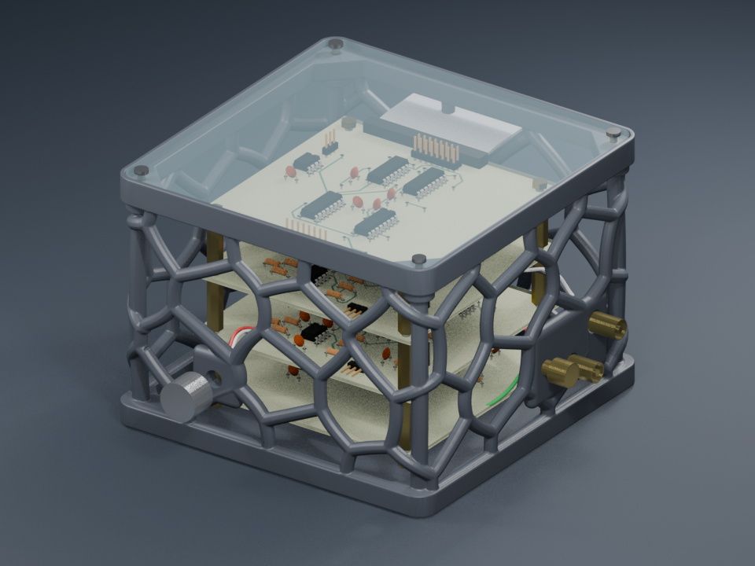

# Organic lattice enclosure

The 144 × 144 × **105 mm** shell is 40 mm taller than the original. An open network of rounded branches wraps all four sides, with solid mounting islands around the existing front control, RCA/ground connectors and rear cable exit. The floor supports the PCB stack; the acrylic lid remains removable with four M3 heat-set inserts.



## Print files

- [Enclosure STL](vinyl_adc_enclosure_base.stl) — one connected, watertight shell, millimetres.
- [Enclosure 3MF](vinyl_adc_enclosure_base.3mf) — the same geometry with explicit millimetre units; no printer or filament profile is embedded.
- [Insert-fit coupon](m3_insert_fit_coupon.stl) — a 48 × 16 × 9 mm test piece, with labelled 4.0, 4.2, 4.4 and 4.6 mm blind holes, each 6.5 mm deep.
- [Geometry print settings](print-settings.ini) — reference settings for PrusaSlicer; select your actual printer and filament profiles separately.
- [Blender assembly](vinyl_adc_enclosure.blend) — editable scene with PCBs, hardware and an exploded timeline. Only the enclosure base is exported to the print files.

## Printing

Print upright with the flat floor on the bed. **Supports are required** beneath shallow lattice branches, mounting islands and the upper rim. Use organic supports, including supports starting on the inside floor; restricting supports to the build plate can leave interior overhangs unsupported. Remove supports before installing inserts and electronics.

The reference slice uses a 0.4 mm nozzle, 0.2 mm layers, four perimeters, 20% infill, five top/bottom layers, 45° support threshold and 0.25 mm support contact gap. PETG is the proposed material; temperatures, cooling, speeds and bed preparation must come from the actual printer/filament profile. Adjust support separation after a small trial. Prusa describes [organic support settings](https://help.prusa3d.com/article/organic-supports_480131) and [PETG printing considerations](https://help.prusa3d.com/article/petg_2059).

Branches are nominally 5.4 mm in diameter and thicken near the connector islands. The four corner load paths are 6.8 mm in diameter. Each top insert sits in a 12 mm diameter boss, so installation and lid-screw loads are carried into the frame. Rounded fused junctions connect the whole print; there are no separate loose ribs.

Do not treat a successful slice as a physical strength or fit test. This revision has not yet been printed. The first assembly should verify support removal, connector nut engagement and cable bend clearance before fitting all electronics.

## Lid and insert fit

The original 140 × 140 × 3 mm acrylic lid, corner shape, cut files and hole positions are retained. Its underside sits at Z = 102 mm. Top insert centres remain X/Y = ±64 mm; PCB mounting centres remain X/Y = ±44 mm.

Top insert pilots are **4.2 mm diameter × 6.5 mm deep**, matching the existing design's approximately 4.6 mm OD, 5.7 mm long M3 insert visualization. M3 inserts vary by manufacturer: print the coupon in the same material and orientation, and match the insert supplier's specified pilot and installation method before printing the full shell. A different insert may require a pilot adjustment; do not force an oversized insert into the frame. The floor fixing geometry is retained from the original design.

Connector centres and cutouts remain at their original coordinates: two 9.5 mm RCA bores, a 6 mm ground-post bore, a 7.5 mm control bore, and a 54 × 10 mm rear cable opening. These are existing design dimensions, not new measurements of the installed hardware. The opening positions do not depend on board spacing; cables route between the boards and panel connectors.

## Stack height

The extra 40 mm is usable enclosure height. The CAD visualization uses 23 mm inter-board standoffs to show a taller stack; this is illustrative because the physical stack was unavailable to measure. In this model, the tallest top-board component reaches Z = 93.94 mm, leaving approximately 8.06 mm under the acrylic. Actual stack height, connector shells and cable loops must fit below Z = 102 mm. The retained PCB meshes are assembly illustrations and may lag newer KiCad component revisions.

## Validation and rebuilding

[validation.json](validation.json) records the mesh checks and sampled rib widths. [slice-validation.json](slice-validation.json) records the supported slice. Cross-section samples are checks at selected rib locations, not a proof of a global minimum wall thickness or mechanical load rating.

Run from the repository root with Blender 5.2:

```sh
blender --factory-startup -b -noaudio --python enclosure/build_enclosure.py
blender --factory-startup -b -noaudio --python enclosure/build_insert_coupon.py
blender --factory-startup -b enclosure/vinyl_adc_enclosure.blend -noaudio --gpu-backend opengl --python enclosure/animation/render_showcase.py
python enclosure/animation/encode_showcase.py
```

`build_enclosure.py -- --standoff 23` changes the illustrative inter-board spacing. It does not move panel cutouts. The retained source in `source/original_assembly.blend` supplies the existing board meshes, acrylic, connector shapes, fixing geometry and animation. The procedural builder replaces the wall skin with a deterministic periodic Voronoi network, fuses rounded joints, simplifies the mesh and recuts the exact connector/pilot openings. The web export merges the explosion tracks into one `Assembly` animation and converts millimetres to metres.
